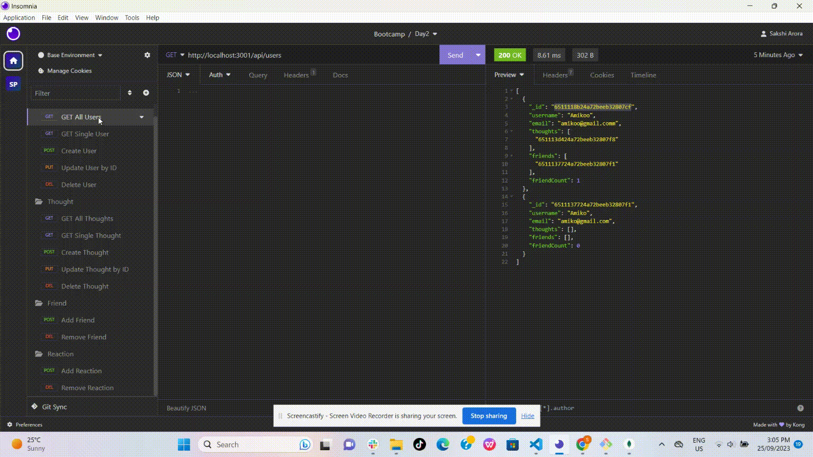
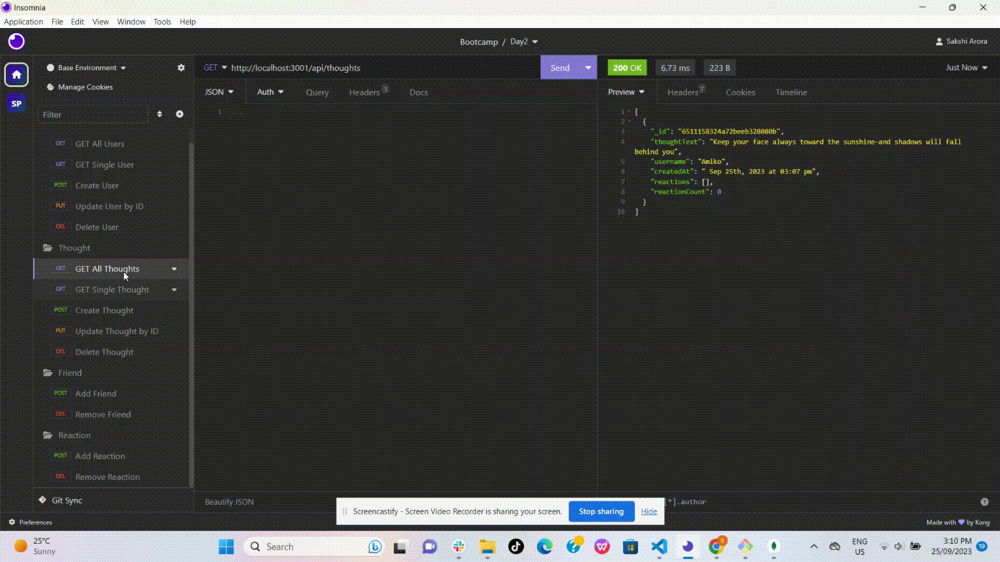
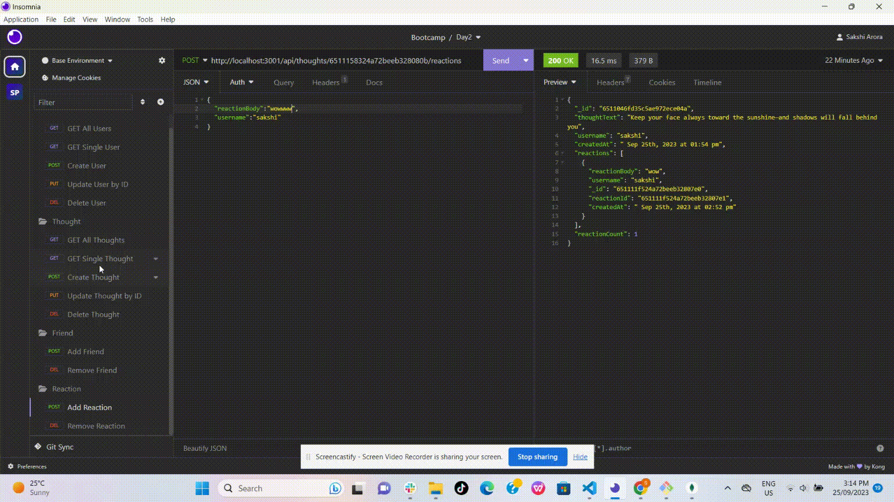

# Social Networking Api

This is API platform for social networking application where users can share their thoughts, react to friend's thoughts, and create a friend list. It uses Express.js for routing, a MongoDB database, the Mongoose ODM to handle large amounts of data with unstructured data.

There are routes for doing the functions and all routes has been tested on insomnia:

**USER**

- Create a new user: POST Route- `/api/users`
- Get all users: GET Route- `/api/users`
- Get a single user by id: GET Route- `/api/users/:userId`
- Update a user by id: PUT Route- `/api/users/:userId`
- Delete a user by  id: DEL Route- `/api/user/:userId`

**FRIEND**

- Add a new friend to friend list: POST Route- `/api/users/:userid/friends/:friendId`
- Delete a friend from friend list by friendId: DEL Route- `/api/users/:userid/friends/:friendId`

**THOUGHT**

- Create a new thought: POST Route- `/api/thoughts/`
- Get all thoughts: GET  Route-`/api/thoughts/`
- Get a single thought by id: GET  Route-`/api/thoughts/:thoughtId`
- Update a thought by id: PUT Route- `/api/thoughts/:thoughtId`
- Delete a thought by id: DEL Route- `/api/thoughts/:thoughtId`

**REACTION**

- Add a reaction: POST Route- `/api/thoughts/:thoughtId/reactions`
- Remove reaction from user's thought by the reactionId: DEL Route- `/api/thoughts/:thoughtId/reactions/:reactionId`

**See the walk-through demonstration video here:**

https://drive.google.com/file/d/1anYL7kJInqM3tQNvqJjzGL-yFyGQE7FY/view?usp=sharing

## Table of Contents

- [Installation](#installation)
- [Usage](#usage)
- [Technologies](#technologies)
- [Credits](#credits)
- [Contact Information](#contact-information)


## Installation

- Download or clone repository from GitHub to local machine.
- To run application, `Node.js` and `MongoDB` is required.
-  Open the terminal and navigate to root directory. Install required dependencies given in package.json by running command:
   ```
   npm install
   ```

## Usage

- When we enter the command to invoke the application, server gets started and the Mongoose models are synced to the MongoDB database

    

- When API GET routes for users and thoughts are opened in Insomnia then the data for each of these routes is displayed in a formatted JSON.

- We can create a user with username and email address. User can have associated thoughts and it can also be updated and deleted by id. When we delete user then its associated thoughts also gets deleted.

    
    

- User can add or remove friends from their friends list.

    

- Thoughts can be created by user by API POST route and user can also update and delete thoughts by id using API PUT, and DELETE routes in Insomnia.

    
    


- There is facility to add or remove reactions on different thoughts by users.

    

## Technologies

1. MongoDB
2. Mongoose
3. Express
4. Javascript
5. Insomnia 
6. Nodemon

## Credits

References:

https://stackoverflow.com/questions/13699784/mongoose-v-property-hide

https://developer.mozilla.org/en-US/docs/Web/JavaScript/Reference/Global_Objects/Date/toLocaleTimeString

## Contact Information

Github Username: [sakshiarora04](https://github.com/sakshiarora04)

Email id: sakshiarora245@gmail.com
